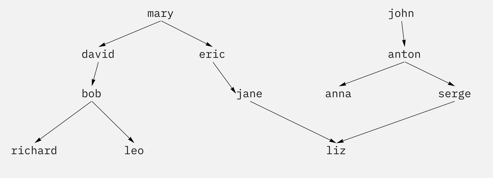

## Лекция 1
`3 сентября 2021`

Всего есть трии парадигмы:
- императивная: программа состоит из последовательности действий
- функциональная: программа состоит из функций
- логическая: программа состоит из логических формул

Основная единица в логической парадигме – *предикат*.

**Предикат** – функция, которая определяет, есть определенная связь между её параметрами или нет.

**Запрос** – логическая формула. Пролог вычисляет, является ли запрос следствием логических формул программы.

При доказательстве может быть ветвление, вычисляются все воозможные варианты (*back tracking*).

Операции:
- `,` – конъюнкция
- `;` – дизъюнкция
- `:-` – импликация
- `.` – ставится в конце любоой формулы (но работает в обратную сторону `<=`>)

Формулы есть двух видов:
- факты (`p(...)`)
- правила (`p(...) :- a(...), b(...)`)

> Предикаты и имена объектов с маленькой буквы, имена переменных с большой буквы. _ – анонимная переменная.

**Пример.** Пусть есть такое генеологическое древо:



Напишем программу, чтобы его описать:
```prolog
parent(mary, david).
parent(mary, eric).
parent(john, anton).
parent(david, bob).
...
parent(serge, liz).
man(john).
...
woman(mary).
...
```

Дальше моожно делать запросы, они начинаются с символов `?-`:

```
?- parent(anton, ann).
>>> true
?- parent(serge, ann).
>>> false
?- parent(X, liz).
```

В последнем случае задается вопрос "Могу ли я что-то поставить на место `X`, чтобы получить положительный ответ, и если да, то что?" 

```
>>> jane
```

Если в ответ поставить `;`, то можно увидеть другое доказательство:

```
>>> jane;
>>> serge;
>>> false
```

Можно описать предикат:

```
grandparent(X, Y) :- parent(X, Z), parent(Z, Y).
```

Здесь имеется в виду, что существует какой-то `Z`, для которого `X` является родителем, и при этом `Z` является родителем `Y`.

Другой предикат:

```
brother(X, Y) :- parent(Z, X), parent(Z, Y), man(X), dif(X, Y).
```

`dif` возвращает `true`, если аргументы разные. Здесь это нужно, чтобы человек не был братом самому себе.

```
uncle(X, Y) :- parent(Z, Y), brother(X, Z).
```

Ну и, наконец, рекурсивный предикат – *предикат*:
```
ansector(X, Y) :- parent(X, Y).
ancestor(X, Y) :- parent(Z, Y), ancestor(X, Z).
```

При этом программа может зациклиться, например, если вызов рекурсивной функции поставить до нерекурсивной ветки.